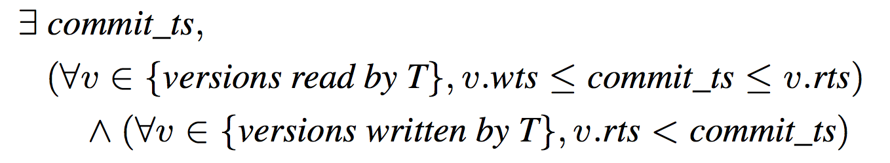
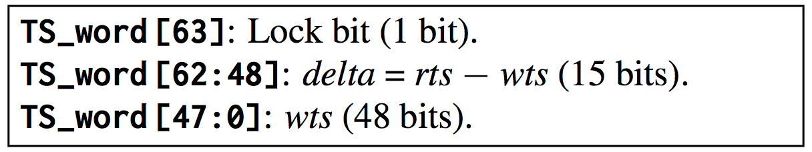
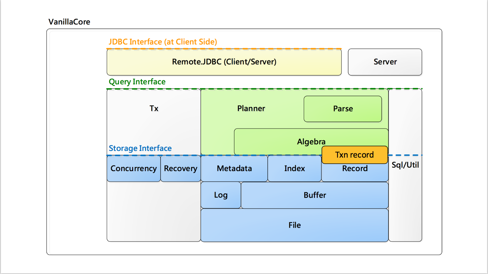
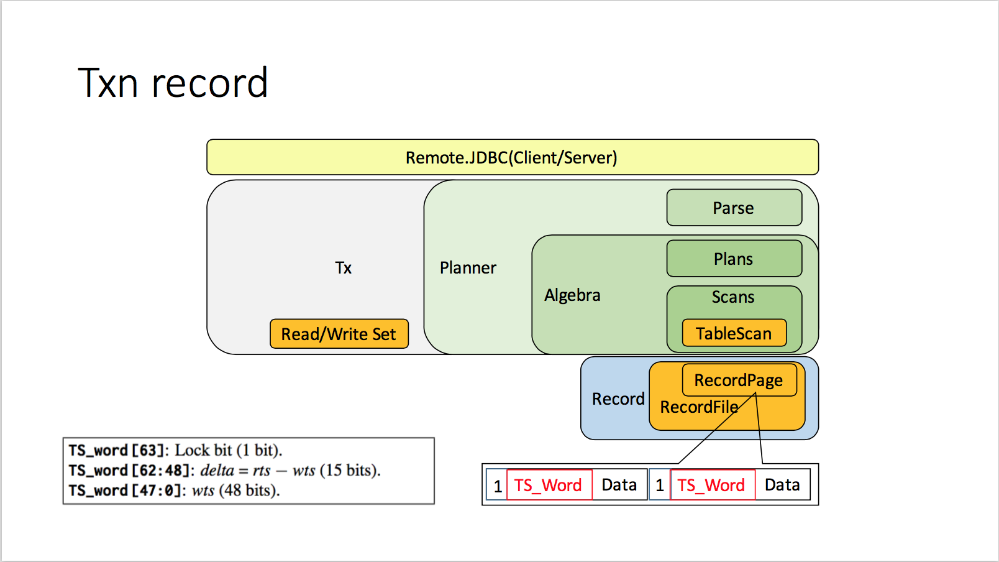
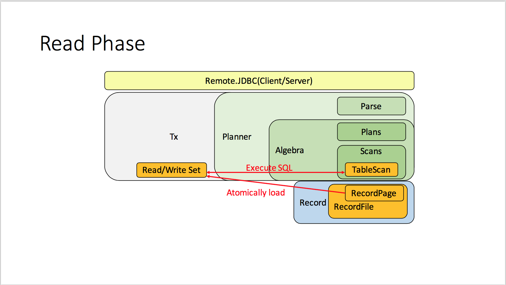
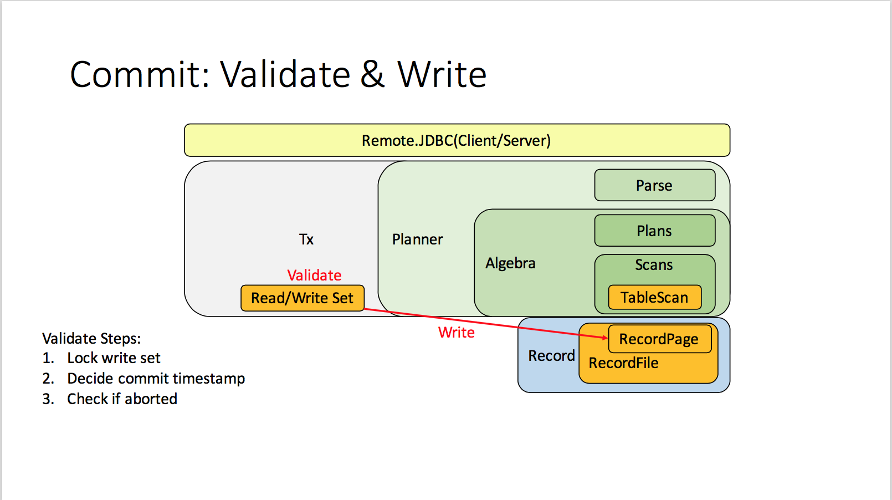
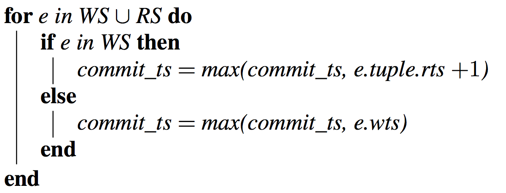
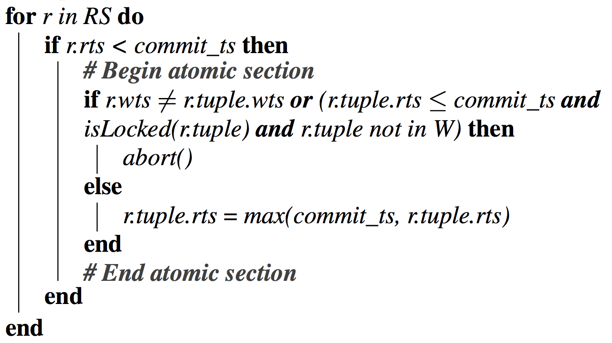
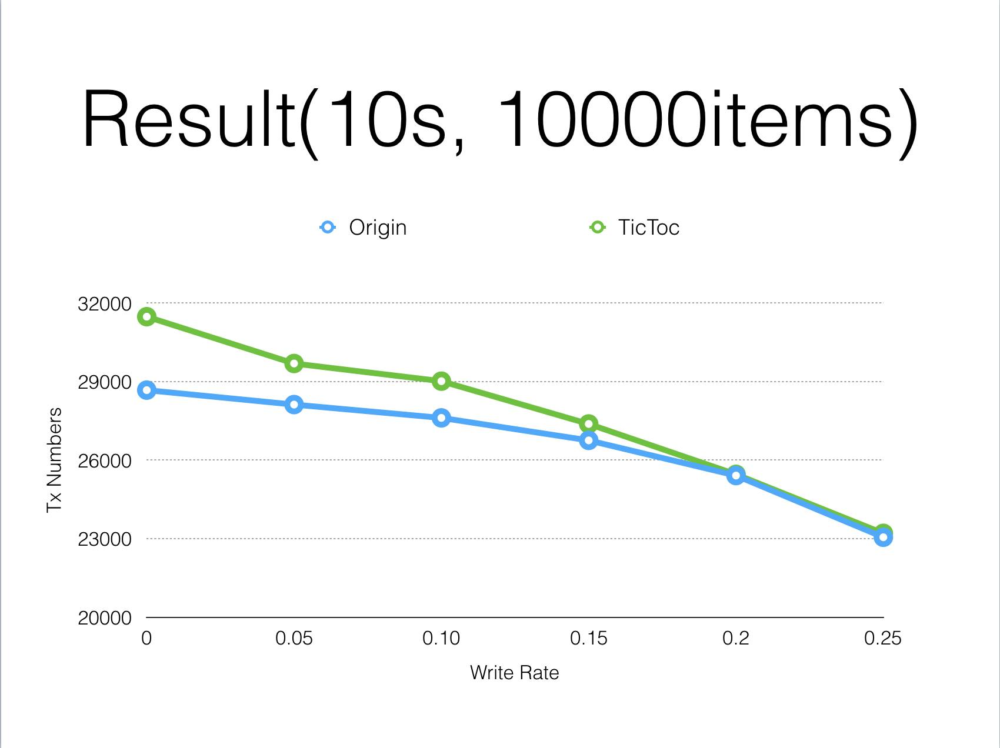

# Cloud Database Final Project Report
Team 9: 104062510 謝承翰、104062506黃郁翔

## 1. Introduction
- Paper name: TicToc: Time Traveling Optimistic Concurrency Control
- Conference: SIGMOD 2015
- Authors: Xiangyao Yu, Andrew Pavlo, Daniel Sanchez, Srinivas Devadas
- TicToc Protocol:
	基於Optimistic Concurrency Control (OCC)改良,傳統OCC中,每個 Transaction執行時會先由系統指定該Transaction的Timestamp,當 Transaction數量一多,系統指定Timestamp會形成Bottleneck。而TicToc的方 式則是由Transaction自行計算Timestamp,每筆record都會帶著TS_WORD, 是由Lock bit, Read Timestamp(RTS), Write Timestamp(WTS)組合而成,透過TS_WORD,Transaction可以在 commit的時候算出自己的commit timestamp,並驗證是否合法,若合法則 commit,寫入DB使改變也讓其他Transaction看到修改。這樣的方式解決的系 統中央指定Timestamp的Bottleneck,繼而達到增進效率的效果。以下我們將 介紹TicToc如何運作以及實作。

## 2. TicToc運作流程
傳統OCC將Transaction執行分為三個階段:Read Phase, Validation Phase, Write Phase,TicToc也分此三個階段進行,但針對執行的過程進行改良。TicToc中每 個record還會帶有lock bit, WTS, RTS
1. Read Phase
將Transaction將需要用到的Record複製一份到自己的read/write set,讀取時會
確認lock bit,若鎖住則等待重讀。 

2. Validation Phase
Transaction commit前,必須驗證自己workspace內讀取或修改的資料是否有效 ,在TicToc中,判斷Transaction是否有效的依據是,每個Transaction的 commit timestamp必須滿足下列不等式:

3. Write Phase
若通過Validate,則將資料寫回DB,另 RTS = WTS = Commit Timestamp,使 其將Transaction也可以看到自己commit的結果。

## 3. Implementation
Implementation主要分為Timestamp, Tuple & Workspace, Three phases, Reset WTS
四個部分以下將逐一做說明:
1. Timestamp
首先要先改變record格式, 讓record塞得進paper提到的TS_WORD:

具體的方式是我們在RecordPage的地方宣告TS_WORD的值, 並且參照每個record都會多出的FLAG, 我們也用相同的方法加入TS_WORD, 所以pos的位置會跟著改變, 有需要改動的地方包含計算offset的method,都要補上TS_WORD_SIZE。
在RecordPage有另一件事情是,所有操作TS_WORD的method都在這裡被定義,包含:
setTS_WORD, isLocked, getLock, releaseLock, getRTS, getWTS和resetWTS這些method。
實作方式是類似的,就是將64bit的TS_WORD做拆解,並且用正確的mask來過濾出想要的值,無論是做回傳或設定。
透過這些method, 就可以由RecordFile拉出RecordPage,來做進一步動作。

2. Tuple & Workspace
    - Read/Write Set:
        為了實現TicToc,每個將Transaction在commit都在自己的獨
立空間執行,我們在Transaction.java中加入兩個集合分別是read set和write set,分別儲存存取的record以及被修改的record
    - TSWord: 
        用於將lock bit, RTS, WTS, encode為TS_word儲存或是decode TS_word 出來用的類別。
    - Tuple: 
    新建一個新的資料結構Tuple,用來儲存複製的record、TSWord,並提供操作介面
    - RecordInfo: 
    用於儲存Tuple在DB的資訊, 可以找到Tuple目前在DB中實際的資料
    - TupleType: 每個Tuple會有一個Type,決定最後commit時候Tuple要執行的動作。
3. Three Phases: Read, Validation, Write
    我們基於VanillaDB實作TicToc, 原始VanillaDB版本是2PL, 執行SQL的方法是, 在呼叫端先create plan取得層層遞迴疊套的plan, 再open plan取得scan, 每次呼叫next()取得下一個符合條件的record, 原版中所有的操作會直接在Buffer中修改, 所有將Transaction都看得到Record被修改, 取用相同Record的將Transaction皆會被影響 到。然而, 我們要做到執行SQL時, 會把變更都寫到將Transaction自己的空間, 每個將Transaction只會看到自己的資料而不會看到其他人對record的修改。因此我們選擇在Scan最底層的TableScan, 負責與RecordFile溝通進行實際的資料讀寫的地方加一層Read/Write Set, 如下圖所示

    - Read Phase: 執行SQL時,我們將TableScan提供的介面(insert, delete, getVal,
setVal) 都改為對Transaction的Read/Write Set進行修改,根據操作的性質不同 存取不同的Set,例如getVal存取read set。若Read/Write Set沒有需要的 Record則透過RecordFile將DB當前的資料Atomically load並複製到Read/Write Set,下次有需要就都從Read/Write Set存取修改,如Figure.3。

    - Validate Phase: 在Commit前,先執行validate的驗證程序,若有不合法的情況 則rollback transaction。validate的程序分為三個步驟:
        - Step 1: 鎖住write set的tuples,這邊特別的是write set的tuple會依照 primary key排序之後才鎖,採用fixed order locking避免產生deadlock
        - Step 2: 計算commit timestamp,計算的方法如下

        - Step 3: validate read set中tuple的正確性,這邊同樣是利用上述的不等式來驗證,演算法如下

    這邊判斷的概念主要是,要判斷read set中那些不符合下列不等式的tuple。這 樣的tuple有兩種可能,一是因為自已修改了這個tuple,也就是此tuple屬於自己 的write set,這樣的情況是合法的,因為符合write set的不等式。二是這個 tuple被其他transaction修改了,當複製tuple的WTS不等於DB當前的WTS時, 表示有其他的transaction 修改了他並且commit,才會導致WTS不相等。另外 就是若r.tuple.rts (DB中當前RTS) 小於等於commit_ts,表示曾有Transaction對 此tuple進行修改,因為我們可以看到commit_ts是在Step 2計算時由DB中當前 RTS+1而得,故被修改過就會滿足(r.tuple.rts <= commit_ts,換個角度來看, 若沒被修改過,表示tuple都在read set ,commit_ts都是由此tuple的WTS決定 ,WTS必定<=RTS,因此commit_ts不會超過RTS。在透過RTS確定tuple有被 修改之後,還要lock及屬不屬於write set來判斷是否為自己修改的,如果其他 Transaction改的,表示此Tuple的資料已是unclean了,必須abort。
    

    - Write Phase: 到此階段要將存於Transaction獨立空間的修改都寫到DB裡,讓 其他Transaction也能看到變更,於此同時,也將tuple的RTS和WTS設為 commit timestamp。

4. ResetWTS
    之所以需要做Reset是因為WTS儘管為long value,但還是有overflow的一天。 為了防止這種情況發生,就必須對record的WTS做更新。具體的作法是參照 Checkpoint這個thread。首先宣告一個ResetWTS.java,如同checkpoint一般在 固定時刻就喚醒,然後運作。   

    每一個table都會有一個thread專門負責,因此在VanillaDB一開始初始化的地方 ,就會先拉出Table,將Table給進去constructor並且初始化。   
    
    在初始化的過程, 要先取得先前到底運作多久了。這個時間會存在file裡面,由 FileMgr來做讀寫。讀寫的方式是Java一般的讀寫方法,因為只需要紀錄一個值
,不需要做詳細的buffer來處理。為了實作方便,每個ResetWTS會有自己的 file,可以避免掉concurrency的問題。而且如果有某些比較頻繁存取的file,還 可以縮短它reset的時間,這樣設計是有好處的。   

    如果在一般時候,發現accumulated的時間並未超過我們給予的threshold,就 將這個值寫進去檔案裡,這也是透過Vanilladb的fileMgr裡面加的method來完成。
    
    WTS更新的方法為, 時間到後, 透過與一般transaction相同的方式層層呼叫 method,到呼叫Vanilladb的catalogMgr接著往tableMgr, 就會到達resetWTS 函式, 透過Table name來和將Transaction來宣告RecordFile。接著loop整個 table的records(透過beforeFirst和next函式), 就會到達RecordPage的reset 函式了, 由於在(A)有介紹, 便不加贅述, 最主要就是讓每個record的WTS歸零。
    
## 4. Experiment

綠色是我們改的TicToc版本,藍色則是原始2PL版本。從上圖可以看出,在Contention-free的 情況下,TicToc版本會勝出,這是因為TicToc不用先拿lock,可以直接執行,而且在 Contention-free的情況下validate不會發生abort,因此表現優於2PL。隨著Writing rate越來越高,競爭的狀況也隨著升高,這時候在validate發生abort,會拉低TicToc的Throughput,雖然2PL也會因此發生競爭,但因為有事先拿lock,當發生競爭時比較不容易發生abort的情況,所以最後圖的走勢兩者開始交叉。

## 5. Discussion
1. 為什麼需要Timestamp? 不直接比對資料是否相同來判斷有沒有被改過?    
Optimistic concurrency control本身就必須要具備timestamp作為判斷的依據。 適合於data confliction低的環境裡面,可以獲得較高的吞吐量。因此如果是Naive的方法不給予timestamp也是可以的,但是就與Optimistic Concurrency Control本身的概念相違背。孰優孰劣可能得依據Transaction的特性而定。也有可能Timestamp可以用來避免Starvation,如果單純比對資料是否相同的話,沒辦法知道哪個Trasaction可能等了很久了。

2. 可以改進的地方   
    1. 實驗因為時間的關係並沒有做的很完整,數據的可信度不夠,之後應要跑跑看
loading更重的測試,以凸顯TicToc分散式的優點
    2. 可以加上與傳統OCC的比較,才能說明TicToc分散式決定timestamp與傳統集
中式指定timestamp的差異之處
    3. 之後可以試著做出在multicore上實現平行化
